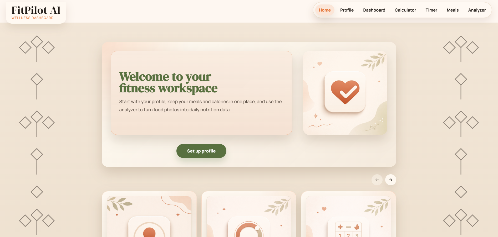
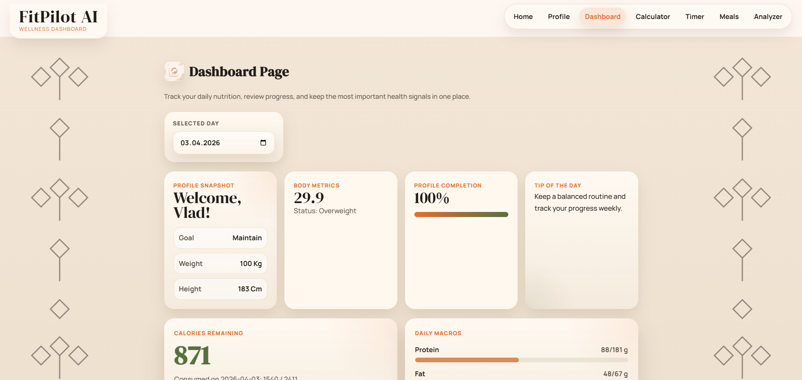
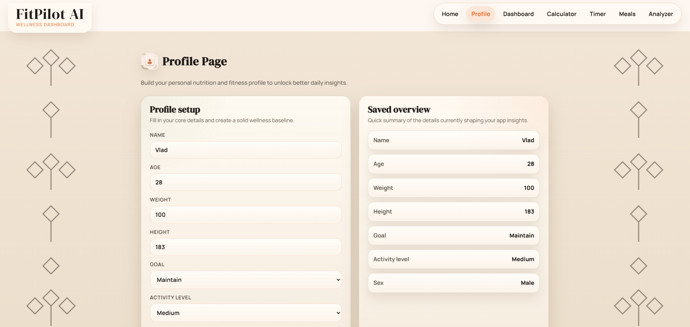
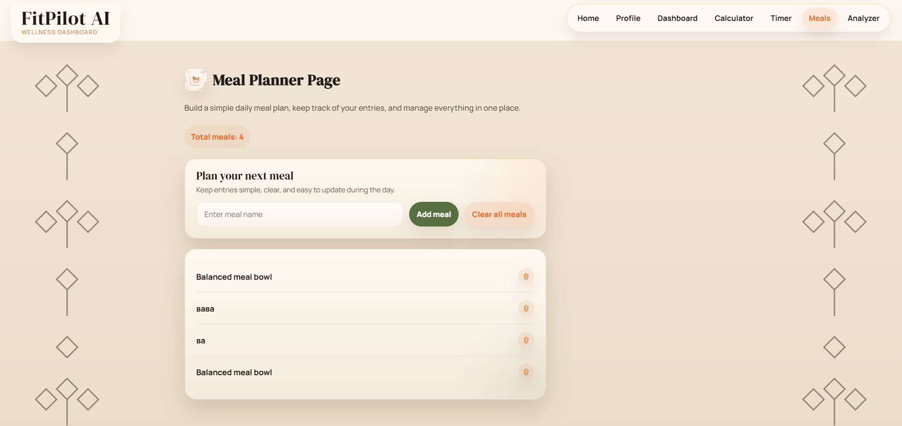
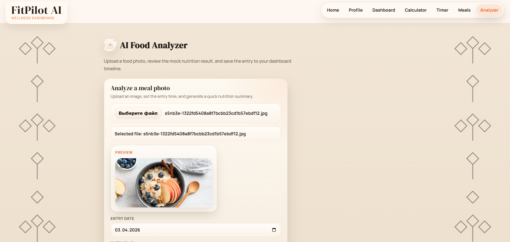

# FitPilot AI

FitPilot AI is a wellness-focused React application for tracking personal profile data, meals, timer sessions, nutrition insights, and simple health calculations in one cohesive workspace.

## English

### Overview

FitPilot AI is a front-end fitness and nutrition dashboard built as a polished multi-page SPA.  
The project combines profile setup, BMI and calorie calculations, meal planning, dashboard summaries, a workout timer, and a mock AI food analyzer.

### Main Features

- Personal profile setup with persistent local storage
- Dashboard with BMI, progress, calorie and macro overview
- Calculator page for BMI, BMR, daily calories, and recommendations
- Workout timer with presets and action controls
- Meal planner with add, delete, clear, and modal tips
- Mock AI food analyzer with image preview and nutrition result panel
- Styled multi-page experience with shared branding, icons, and soft animations

### Pages

- Home
- Profile
- Dashboard
- Calculator
- Timer
- Meals
- Analyzer

### Tech Stack

- React
- Vite
- Redux Toolkit
- React Router
- CSS
- Local Storage

### Run Locally

```bash
npm install
npm run dev
```

Open:

```txt
http://localhost:5173/
```

### Scripts

```bash
npm run dev
npm run lint
npm run build
```

### Screenshots

#### Home



#### Dashboard



#### Profile



#### Meals



#### Analyzer



---

## Українська

### Опис

FitPilot AI — це front-end застосунок у wellness-стилі для збереження профілю, планування харчування, роботи з таймером, перегляду базових nutrition-інсайтів та простих health-обчислень в одному цілісному інтерфейсі.

### Основні можливості

- Заповнення особистого профілю зі збереженням у local storage
- Dashboard з BMI, прогресом, калоріями та макросами
- Сторінка Calculator для BMI, BMR, денної норми калорій і рекомендацій
- Workout timer з пресетами та кнопками керування
- Meal planner з додаванням, видаленням і очищенням списку
- Mock AI food analyzer із прев’ю зображення та блоком результатів
- Стилізований багатосторінковий інтерфейс зі спільною візуальною системою та м’якими анімаціями

### Сторінки

- Home
- Profile
- Dashboard
- Calculator
- Timer
- Meals
- Analyzer

### Технології

- React
- Vite
- Redux Toolkit
- React Router
- CSS
- Local Storage

### Запуск локально

```bash
npm install
npm run dev
```

Потім відкрий:

```txt
http://localhost:5173/
```

### Команди

```bash
npm run dev
npm run lint
npm run build
```

### Скріншоти

#### Home


#### Dashboard


#### Profile


#### Meals


#### Analyzer


